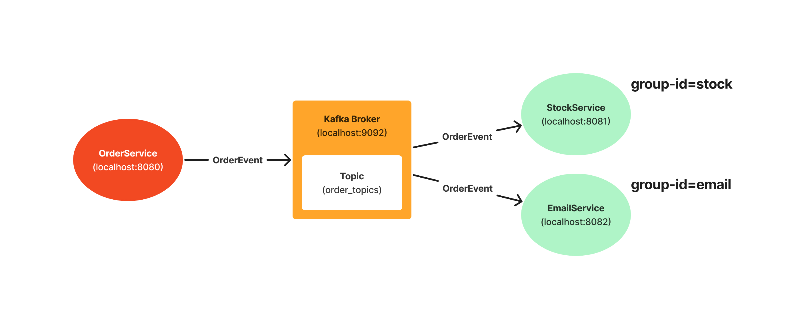

# Event-Driven-MicroServices-with-kafka
## 프로젝트 소개
Apache Kafka를 이용하여 Event-Drive-Architecutre를 적용한 MicroServices를 만들어본다.  
OrderService는 OrderEvent를 Broker에 발행하고  
StockService와 EmailService가 OrderEvent를 구독하여 추가 로직을 수행한다.  

## 설계
